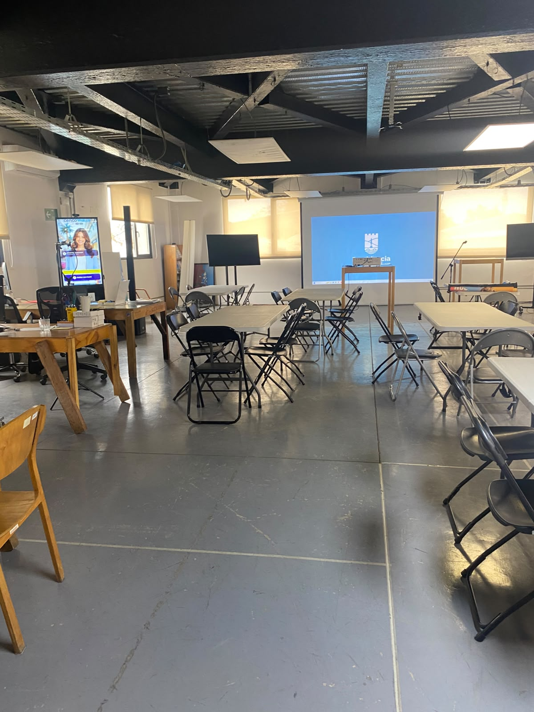
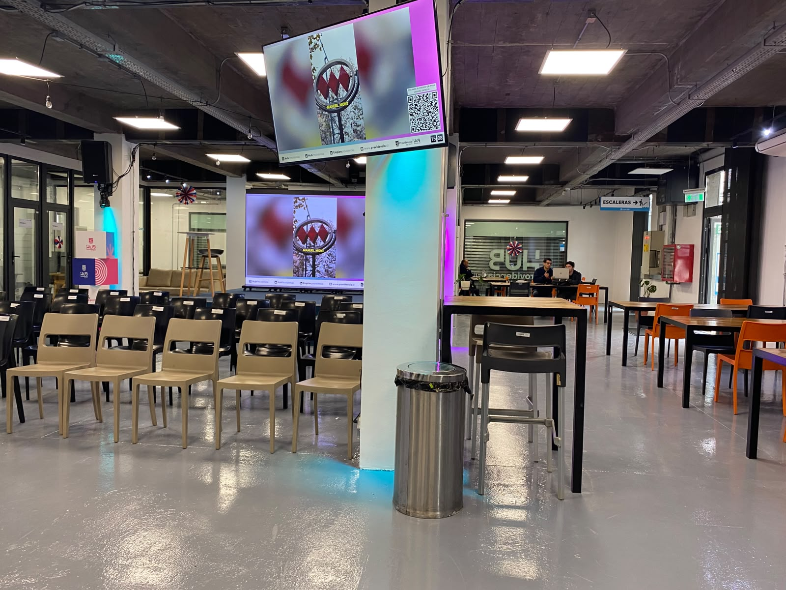
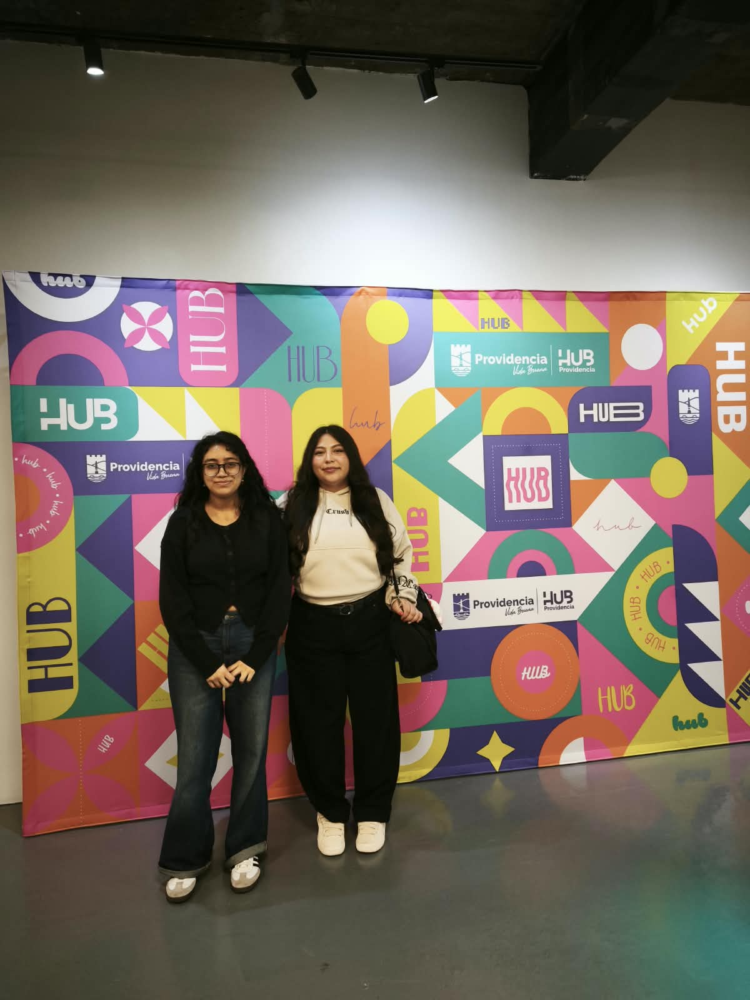

# Sesión — 24 de septiembre de 2026
## Salida educacional a Hub Providencia

**Participantes:** equipo Ingenia 5 completo.

La salida educacional permitió pasar desde una comprensión preliminar del desafío hacia un levantamiento directo en terreno. Durante la jornada se realizó una charla con representantes de Hub Providencia, una instancia de preguntas y respuestas y un recorrido por las instalaciones. El equipo documentó los espacios mediante fotografías y videos y registró antecedentes relevantes para actualizar el diagnóstico del Proyecto Capstone — Desafío 01.

*Figura 4. Sala de trabajo y proyección usada durante la charla inicial.*

*Figura 5. Pantalla del Hub mostrando el código QR utilizado para el registro de usuarios.*

---

### 22.1 Objetivo de la visita

Conocer directamente el funcionamiento del Hub Providencia y recopilar evidencia para comprender cómo ingresan, permanecen y utilizan los espacios las personas usuarias; qué información se registra actualmente; qué dificultades enfrenta el equipo de gestión; y qué necesidades deberían orientar las etapas posteriores del proyecto.

### 22.2 Desarrollo de la jornada

- Charla inicial con representantes de Hub Providencia y resolución de dudas relacionadas con el Desafío 01.
- Formulación de preguntas sobre ingreso, registro, recurrencia, utilización de espacios, reservas, indicadores y necesidades de información.
- Recorrido por las instalaciones para observar directamente espacios, servicios y condiciones de uso.
- Registro fotográfico y audiovisual de los espacios visitados.
- Contraste entre los supuestos definidos en etapas anteriores y la información obtenida directamente en terreno.

*Figura 6. Integrantes del equipo durante la visita a Hub Providencia.*

### 22.3 Levantamiento de información — preguntas y respuestas

| # | Pregunta levantada | Respuesta / evidencia obtenida |
| --- | --- | --- |
| 1 | ¿Cómo ocurre actualmente el ingreso, permanencia y salida? | El proceso comienza con el ingreso al Hub y el registro correspondiente según el espacio o servicio. El cowork general es abierto; algunos servicios requieren inscripción o coordinación. No se identificó un procedimiento formal consolidado de registro de salida. |
| 2 | ¿Qué información se solicita y qué se conserva? | El registro actual se realiza mediante un formulario digital asociado a un código QR y las respuestas se almacenan en Google Sheets. En cada visita se debe completar nuevamente el registro; el sistema no reconoce automáticamente a una persona previamente registrada. Los campos exactos del formulario no se afirman porque no fueron verificados en la evidencia disponible. |
| 3 | ¿Qué dificultades enfrenta el equipo de gestión? | Existe un nivel limitado de automatización e integración. Los registros de distintas visitas no necesariamente quedan consolidados en un único perfil, dificultando conocer usuarios únicos, total de visitas, recurrencia, horarios, espacios utilizados, motivos, perfiles y permanencia. |
| 4 | ¿Qué información necesita el equipo para planificar mejor? | Sería útil disponer de usuario único, fecha, horas de ingreso y salida, tipo de usuario, motivo, servicio y espacio utilizado, duración, frecuencia y datos de reserva. Estos campos corresponden a una propuesta derivada del diagnóstico y no a variables que se afirme que el Hub ya recopila. |
| 5 | ¿Qué tipos de usuarios visitan el Hub y con qué objetivos? | Durante la visita se mencionaron estudiantes, trabajadores y colaboradores, dentro de una población diversa. Los usos pueden asociarse a trabajo, reuniones, colaboración, formación, emprendimiento, innovación, empleabilidad y actividades. No se dispone de porcentajes que permitan afirmar cuál grupo es mayoritario. |
| 6 | ¿Qué espacios presentan mayor o menor utilización? | La ocupación varía según día y horario, pero no existe un sistema histórico consolidado que permita determinar objetivamente espacios de mayor o menor uso, horas punta, baja demanda, porcentaje de ocupación o problemas de capacidad. |
| 7 | ¿Qué fricciones existen en el ingreso o registro? | La principal fricción identificada es la repetición del registro. Una persona recurrente vuelve a ingresar mediante QR y completar información, aumentando el tiempo de ingreso, generando una experiencia repetitiva y produciendo múltiples registros para una misma persona. |
| 8 | ¿Qué restricciones de privacidad y seguridad deben considerarse? | La futura solución debe aplicar minimización de datos, definir finalidad, acceso, conservación, protección y consentimiento cuando corresponda. Para análisis y tableros conviene privilegiar información agregada o anonimizada cuando no sea necesaria la identificación individual. |
| 9 | ¿Qué indicadores serían útiles para la gestión? | Usuarios únicos, total de visitas, visitas promedio por usuario, usuarios nuevos y recurrentes, visitas por día y franja horaria, ocupación por espacio, porcentaje de ocupación, permanencia, motivo, tipo de usuario, reservas solicitadas y utilizadas, y solicitudes rechazadas por capacidad. |
| 10 | ¿Cómo funciona actualmente el sistema de reserva? | Para determinados espacios existe un componente importante de gestión manual y la disponibilidad debe consultarse o coordinarse con el equipo. El cowork general no debe describirse como un sistema de reserva único, pues funciona sin reserva previa. |
| 11 | ¿Han existido dificultades con las reservas? | La dependencia de intervención manual obliga al personal a responder consultas, revisar disponibilidad y coordinar determinadas solicitudes. Esto representa una oportunidad para estructurar y centralizar parte del proceso. |
| 12 | ¿Cuánto demora aproximadamente la respuesta de una reserva? | No existe información consolidada suficiente para calcular un tiempo promedio de respuesta. Una futura solución podría registrar fecha y hora de solicitud, fecha y hora de respuesta y resultado para construir indicadores de tiempo de atención. |

### 22.4 Principales hallazgos de la visita

- El Hub ya dispone de un mecanismo digital de registro mediante formulario y código QR; por lo tanto, el problema no es simplemente la inexistencia de datos.
- La principal brecha observada es la falta de integración e identificación única que permita reconocer a usuarios recurrentes y consolidar su historial.
- La repetición del registro constituye una fricción para personas que utilizan el Hub con frecuencia.
- No se dispone de información histórica consolidada sobre utilización de espacios, duración de permanencia y patrones horarios.
- Determinadas reservas requieren coordinación manual y no existe información consolidada para medir tiempos de respuesta.
- Los datos acumulados podrían transformarse en indicadores de gestión para apoyar decisiones de capacidad, programación y utilización de espacios.

### 22.5 Indicadores identificados para apoyar la toma de decisiones

| Indicador | Utilidad |
| --- | --- |
| Usuarios únicos por día/semana/mes | Conocer cuántas personas diferentes utilizan el Hub. |
| Número total de visitas | Medir la demanda general. |
| Visitas promedio por usuario | Identificar recurrencia. |
| Usuarios nuevos vs. recurrentes | Analizar recurrencia y fidelización. |
| Visitas por día y franja horaria | Identificar jornadas y horas de mayor demanda. |
| Ocupación por espacio / porcentaje de ocupación | Comparar uso de cada espacio respecto de su capacidad. |
| Tiempo promedio de permanencia | Comprender intensidad de utilización. |
| Motivo de visita y tipo de usuario | Caracterizar necesidades y segmentos. |
| Reservas solicitadas y utilizadas/no utilizadas | Analizar demanda y eficiencia del sistema de reservas. |
| Solicitudes rechazadas por falta de capacidad | Detectar potenciales cuellos de botella. |

### 22.6 Problema actualizado después del levantamiento

Hub Providencia dispone actualmente de mecanismos para registrar a sus usuarios, principalmente mediante formularios digitales asociados a códigos QR, pero la información generada no se encuentra suficientemente integrada y automatizada para identificar de forma eficiente a usuarios recurrentes, caracterizar sus perfiles, conocer sus patrones de utilización y analizar la ocupación de los distintos espacios. Esto provoca registros repetidos, dificulta determinar usuarios únicos y frecuencia de visita y limita la generación de indicadores para apoyar decisiones sobre capacidad, horarios, actividades, reservas y utilización de espacios.

### 22.7 Necesidad detectada para el Proyecto Capstone

Diseñar una solución que permita registrar, identificar y caracterizar de manera eficiente a las personas usuarias del Hub Providencia, reduciendo la repetición del registro y generando información estructurada sobre frecuencia de visitas, perfiles, horarios, utilización de espacios y servicios, de manera que el equipo pueda tomar decisiones basadas en datos.

### 22.8 Evidencias y trazabilidad

- Documento de preguntas y respuestas levantadas durante la visita (sección 22.3).
- Registro fotográfico de las instalaciones: [`imagenes/visita-01-sala-recorrido.jpg`](../imagenes/visita-01-sala-recorrido.jpg), [`imagenes/visita-02-sala-pantalla.jpg`](../imagenes/visita-02-sala-pantalla.jpg), [`imagenes/visita-06-equipo-backdrop.jpg`](../imagenes/visita-06-equipo-backdrop.jpg).
- Videos del recorrido y de los espacios observados: [`videos/visita-03.mp4`](../videos/visita-03.mp4), [`videos/visita-04.mp4`](../videos/visita-04.mp4), [`videos/visita-05.mp4`](../videos/visita-05.mp4), [`videos/visita-07.mp4`](../videos/visita-07.mp4), [`videos/visita-08.mp4`](../videos/visita-08.mp4).
- Notas y observaciones obtenidas durante la charla y el recorrido.
- Comparación entre los supuestos previos y los hallazgos obtenidos en terreno.

> **Nota de trazabilidad:** la bitácora registra únicamente hechos respaldados por la evidencia disponible. Cuando un dato concreto no fue verificado —por ejemplo, los campos exactos del formulario o estadísticas de uso por perfil— se mantiene explícitamente como información pendiente y no se presenta como resultado confirmado.

### 22.9 Continuidad hacia la clase del 01/10/2026

Los hallazgos de la visita proporcionan el puente entre la fase de comprensión del problema y la fase de ideación. Con una definición más precisa de las brechas —recurrencia, trazabilidad, ocupación, reservas y analítica—, la clase siguiente se orientó a investigar soluciones existentes, definir atributos relevantes, comparar alternativas y generar propuestas conceptuales mediante Estado del Arte y Benchmark. Ver [sesión 01-10-2026](./2026-10-01-idear-conceptualizar.md).

---
[⬅ Volver al índice](../README.md)
